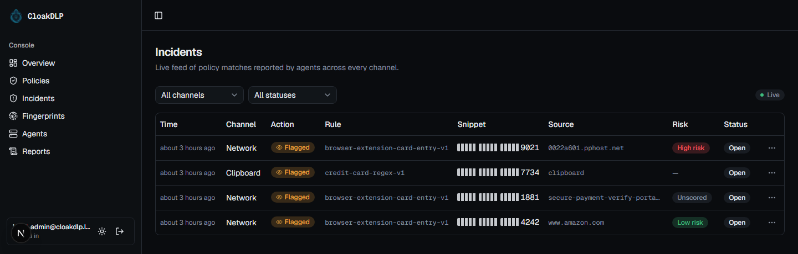

<div align="center">

  

  # 💳 CloakDLP

  **Know the moment your card number leaves the keyboard.**

  [](https://github.com/MAXIVA11/CloakDLP/releases/latest)
  
  
  
  
  
  

  <sub>🖥️ Windows agent · 🧩 browser extension · 🔔 tray alerts · 🕵️ risk-scored domains</sub>

</div>

---

You know the feeling: a bank statement lands with a charge you don't recognize, and you're left
guessing whether it's fraud or something you forgot about months ago. CloakDLP watches the moment
that actually matters, the second you type a card number into a form, and tells you exactly where
it went and how sketchy that destination looks, before your bank ever has to.

<p align="center">
  
</p>

## 🔍 What's inside

- **Catches typed entry, not just copy-paste.** A browser extension reads the number straight out
  of the checkout form before your browser encrypts it, so this needs no TLS interception at all.
  Luhn-validated and redacted to last-4 client-side; the full number never leaves your browser.
- **A risk score for where it went.** Every network match gets checked against a live
  malware/phishing blocklist and a domain-age lookup, both free, shown right next to the entry.
- **A notification, not just a log row.** A small tray app watches the live incident feed and
  pops a Windows notification the moment a card gets entered.
- **Actually zero config.** Install the MSI, open the console, you're signed in already. The
  agent pairs itself with the console on first run and a "Credit Card Entry" policy exists before
  you've touched anything.
- **The general DLP engine is still under the hood.** SSN detection, secret/token patterns,
  salted exact-data-match, and a from-scratch document fingerprinter, watching clipboard, file,
  print, and network channels, in case card entry isn't the only thing you care about.

## 🚀 Get it running

**Just want it running?** Grab the installer from
[the latest release](https://github.com/MAXIVA11/CloakDLP/releases/latest) and run it (admin
elevation required). Two Windows services install and start automatically, plus a tray notifier.
Open the Start Menu shortcut and the console signs you in on its own.

**Want to hack on it instead?**

```bash
# console-backend
cd console-backend && python -m venv .venv && .venv\Scripts\pip install -r requirements.txt
.venv\Scripts\uvicorn app.main:app --port 8123

# console-frontend (separate terminal)
cd console-frontend && npm install && npm run dev

# agent (separate terminal), self-registers with the console automatically
cd agent\CloakDlp.Agent && dotnet run -- monitor

# browser extension: chrome://extensions, Developer mode, Load unpacked, browser-extension/
```

## 🧠 Curious how it works

Zero-config pairing, domain risk scoring, why the extension isn't a TLS-intercepting proxy, the
EDM hashing scheme, the CTPH fingerprint spec, every "we tried X, it got blocked, here's why we
switched to Y" along the way: it's all in [ARCHITECTURE.md](ARCHITECTURE.md), written to be read,
not skimmed.

```
CloakDLP/
  agent/CloakDlp.Agent/   C#/.NET endpoint agent (clipboard, file, print, network channels)
  agent/CloakDlp.Tray/    per-user notification tray app
  browser-extension/      card-entry detection without touching TLS
  console-backend/        FastAPI policy/incident API
  console-frontend/       Next.js console UI
  installer/              WiX-built MSI
  ARCHITECTURE.md          the real design doc
```

---

<div align="center"><sub>MIT License, built so your next surprise charge isn't a surprise</sub></div>
